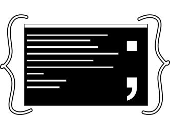

# CommandDotNet

[]()  [](https://ci.appveyor.com/project/bilal-fazlani/commanddotnet/branch/master)  []()

[]()  []()  []()

Table of contents:

- [Installation](#installation)
- [Introduction](#introduction)
- [Constructor parameters](#constructor-parameters)
- [Default values](#default-values)
- [Application and Command metadata](#application-and-command-metadata)
- [Command arguments](#command-arguments)
- [Collections](#collections)
- [Supported parameter types](#supported-parameter-types)
- Validations
- Settings
- Default command
- Version option
- Flags
- Auto case correction

## Installation

From nuget: https://www.nuget.org/packages/CommandDotNet


## Introduction

Let's say you want to create a calculator console application which can perform 2 operations:

1. Addition
2. Subtraction

It prints the results on console.

Let's begin with creating the class

```c#
public class Calculator
{
    public void Add(int value1, int value2)
    {
        Console.WriteLine($"Answer:  {value1 + value2}");
    }

    public void Subtract(int value1, int value2)
    {
        Console.WriteLine($"Answer:  {value1 - value2}");
    }
}
```

Now that we have our calculator ready, let's see about how we can call it from command line.


```c#
class Program
{
    static void Main(string[] args)
    {
        AppRunner<Calculator> appRunner = new AppRunner<Calculator>();
        int exitCode = appRunner.Run(args);
        Environment.Exit(exitCode);
    }
}
```

Assuming our application's name is `example.dll`

let's try and run this app from command line using dotnet

INPUT

```bash
dotnet example.dll --help
```

OUTPUT

```bash
Usage: dotnet example.dll [options] [command]

Options:
  -h | -? | --help  Show help information

Commands:
  Add
  Subtract

Use "dotnet example.dll [command] --help" for more information about a command.

```

Voila!

So, as you might have already guessed, it is detecting methods of the calculator class. How about adding some helpful description.

```c#
[ApplicationMetadata(Description = "Adds two numbers. duh!")]
public void Add(int value1, int value2)
{
    Console.WriteLine($"Answer: {value1 + value2}");
}
```

This should do it.

Let's see how the help appears now.

```bash
Usage: dotnet example.dll [options] [command]

Options:
  -h | -? | --help  Show help information

Commands:
  Add        Adds two numbers. duh!
  Subtract

Use "dotnet example.dll [command] --help" for more information about a command.

```

Awesome. Descriptions are not required but can be very useful depending upon the complexity of your app and the audience. 

Now let's try to see if we can get further help for the add command.

INPUT

```bash
dotnet example.dll Add --help
```

OUTPUT

```bash
Usage: dotnet example.dll Add [options]

Options:
  -h | -? | --help  Show help information
  --value1          Int32 | Required
  --value2          Int32 | Required
```

tada!

Ok, so here, it show what parameters are required for addition and their type.

Let's try and add two numbers.

INPUT

```bash
dotnet example.dll Add --value1 40 --value2 20
```

OUTPUT

```bash
Answer: 60
```

Cool. You get the gist of this library. Let's move on.

## Constructor parameters

Let's say we want to add a class level field which is useful in both Addtion and Subtraction. So now the class looks something like this-

```c#
public class Calculator
{
    private readonly bool _printValues;

    public Calculator(bool printValues)
    {
        _printValues = printValues;
    }
    
    [ApplicationMetadata(Description = "Adds two numbers. duh!")]
    public void Add(int value1, int value2)
    {
        if (_printValues)
        {
            Console.WriteLine($"value1 : {value1}, value2: {value2}");
        }
        Console.WriteLine($"Answer:  {value1 + value2}");
    }

    public void Subtract(int value1, int value2)
    {
        if (_printValues)
        {
            Console.WriteLine($"value1 : {value1}, value2: {value2}");
        }
        Console.WriteLine($"Answer: {value1 - value2}");
    }
}
```

Let's see what the help command output looks like now

INPUT

```bash
dotnet example.dll --help
```

OUTPUT

```bash
Usage: dotnet example.dll [options] [command]

Options:
  -h | -? | --help  Show help information
  --printValues     Boolean | Required

Commands:
  Add        Adds two numbers. duh!
  Subtract

Use "dotnet example.dll [command] --help" for more information about a command.
```

Let's try and invoke it

INPUT 

```bash
dotnet example.dll --printValues true Subtract --value1 30 --value2 5
```

OUTPUT

```bash
value1 : 30, value2: 5
Answer: 25
```

**Note that you can skip to pass any parameter. It will then fallback to the default value of parameter type**

In this case, for `--printValues` it will fallback to `false` & if you dont pass either `--value1` or `--value2`, it will fallback to `0`.

**NOTE: Only one constructor is supported. If there are multiple, it will pick up first defined constructor**

## Default values

C# supports default values for parameters and so does this library.

Let's make some changes to Calculator to add a new Command - `Divide`. And let's default value2 to 1 when user doesn't provide a value.
This will prevent the calculator from crahsing because of `DivideByZeroException`

```c#
public void Divide(int value1, int value2 = 1)
{
    Console.WriteLine($"Answer: {value1 / value2}");
}
```

Here's how help looks like:

INPUT 
```bash
dotnet example.dll Divide --help 
```

OUTPUT

```bash
Usage: dotnet example.dll Divide [options]

Options:
  -h | -? | --help  Show help information
  --value1          Int32 | Required
  --value2          Int32 | Default value: 1
```

## Application and Command metadata

You can use the `[ApplicationMetadata]` attribute on the class level like this to provide details when application is called with `help` switch.

Example: 

```c#
[ApplicationMetadata(Description = "This is a crappy calculator", ExtendedHelpText = "Some more help text that appears at the bottom")]
public class Calculator
{
}
```

This attribute can also be used on a Method as shown below.

```c#
[ApplicationMetadata(Description = "Subtracts value2 from value1 and prints output", 
    ExtendedHelpText = "Again, some more detailed help text which has no meaning I still have to write to demostrate this feature",
    Name = "subtractValues")]
public void Subtract(int value1, int value2)
{
}
```

Note that when you use ApplicationMetadata attribute on a method, you can change the name of the command that is different from method name.

INPUT

```bash
dotnet example.dll --help
```

OUTPUT

```bash
This is a crappy calculator

Usage: dotnet example.dll [options] [command]

Options:
  -h | -? | --help  Show help information
  --printValues     Boolean | Required

Commands:
  Add             Adds two numbers. duh!
  Divide
  subtractValues  Subtracts value2 from value1 and prints output

Use "dotnet example.dll [command] --help" for more information about a command.
Some more help text that appears at the bottom
```

## Command arguments

By default, the parameter names declared in method are the argument names. However you can change that.
By convention, an argument can have a short name and/or a longname.

Let's see an example-

```c#
public void LaunchRocket([Argument(
    LongName = "planet", 
    ShortName = "p", 
    Description = "Name of the planet you wish the rocket to go. Sorry for bad example :(")] string planetName)
{
    return;
}
```

This is what help looks like-

```bash
Usage: dotnet example.dll LaunchRocket [options]

Options:
  -h | -? | --help  Show help information
  --planet | -p     String                         Name of the planet you wish the rocket to go. Sorry for bad example :(
```

So planet name can now be passed either with `--planet` or `-p`. Specifying both is not required. 
You can specify either long name or short name or both. When none is specified, it will use parameter name by default. Description is also optional.

## Collections

Let's enhance our rocket launcher to support multiple planets.

```c#
public void LaunchRocket([Argument(ShortName = "p")] List<string> planets)
{
    return;
}
```

This is what help information looks like-

INPUT

```bash
dotnet example.dll LaunchRocket --help
```

OUTPUT

```bash
Usage: dotnet example.dll LaunchRocket [options]

Options:
  -h | -? | --help  Show help information
  -p                String (Multiple)
```

And this is how you pass multiple parameters:

```bash
dotnet example.dll LaunchRocket -p mars -p earth -p jupiter
```

## Supported parameter types

As of now, these are supported parameter types:

- `int`
- `int?`
- `long`
- `long?`
- `string`
- `bool`
- `bool?`
- `List<string>`
- `List<int>`
- `List<long>`
- `List<bool>`

These are applicable for both - methods and constructor

