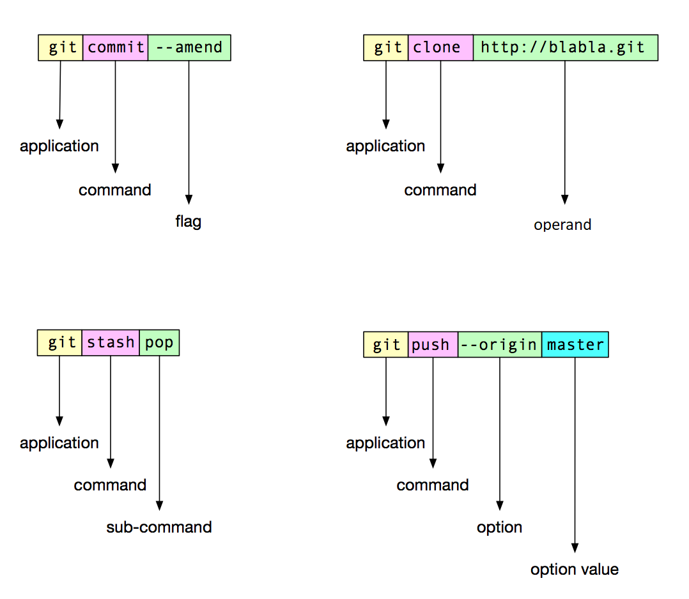

# CommandDotNet

[]()  [](https://ci.appveyor.com/project/bilal-fazlani/commanddotnet/branch/master)  [](https://ci.appveyor.com/project/bilal-fazlani/commanddotnet/build/tests)

[](https://www.nuget.org/packages/CommandDotNet)  [](https://www.nuget.org/packages/CommandDotNet)

Table of contents:

- [Installation](#installation)
- [Introduction](#introduction)
- [Parameters](#parameters)
    - [Arguments](#arguments)
    - [Options](#options)
    - [Flags](#flags)
- [Attributes](#attributes)
    - [ApplicationMetadata](#applicationmetadata)
    - [SubCommand](#subcommand)
    - [Argument](#argument)
    - [Option](#option)
- [Constructor options](#constructor-options)
- [Default values](#default-values)
- [Collections](#collections)
    - [Collection of options](#collection-of-options)
    - [Collection of arguments](#collection-of-arguments)
- [Supported parameter types](#supported-parameter-types)
- [Modeling](#modeling) (new!)
- [Fluent validation for parameters](#fluent-validation-for-parameters) (new!)
- [Custom return codes](#custom-return-codes)
- [Default method](#default-method)
- [Async methods](#async-methods)
- [Nesting commands](#nesting-commands)
- [Settings](#settings)
    - [Show argument details](#show-argument-details)
    - [Method argument mode](#method-argument-mode)
    - [Enable version option](#enable-version-option)
    - [Case](#case)
    - [Boolean mode](#boolean-mode)
        - [Flag clubbing](#flag-clubbing)
- [Exception handling](#exception-handling)
- [Dependency Injection](#dependency-injection) (new!)
    - [Autofac](#autofac)
    - [Microsoft](#microsoft)

## Installation

From nuget: https://www.nuget.org/packages/CommandDotNet

## Introduction

Let's say you want to create a calculator console application which can perform 2 operations:

1. Addition
2. Subtraction

It prints the results on console.

Let's begin with creating the class

```c#
public class Calculator
{
    public void Add(int value1, int value2)
    {
        Console.WriteLine($"Answer:  {value1 + value2}");
    }

    public void Subtract(int value1, int value2)
    {
        Console.WriteLine($"Answer:  {value1 - value2}");
    }
}
```

Now that we have our calculator ready, let's see about how we can call it from command line.


```c#
class Program
{
    static int Main(string[] args)
    {
        AppRunner<Calculator> appRunner = new AppRunner<Calculator>();
        return appRunner.Run(args);
    }
}
```

Assuming our application's name is `example.dll`

let's try and run this app from command line using dotnet

INPUT

```bash
dotnet example.dll --help
```

OUTPUT

```bash
Usage: dotnet example.dll [options] [command]

Options:
  -h | -? | --help  Show help information

Commands:
  Add
  Subtract

Use "dotnet example.dll [command] --help" for more information about a command.

```

Voila!

So, as you might have already guessed, it is detecting methods of the calculator class. How about adding some helpful description.

```c#
[ApplicationMetadata(Description = "Adds two numbers. duh!")]
public void Add(int value1, int value2)
{
    Console.WriteLine($"Answer: {value1 + value2}");
}
```

This should do it.

Let's see how the help appears now.

```bash
Usage: dotnet example.dll [options] [command]

Options:
  -h | -? | --help  Show help information

Commands:
  Add        Adds two numbers. duh!
  Subtract

Use "dotnet example.dll [command] --help" for more information about a command.

```

Awesome. Descriptions are not required but can be very useful depending upon the complexity of your app and the audience. 

Now let's try to see if we can get further help for the add command.

INPUT

```bash
dotnet example.dll Add --help
```

OUTPUT

```bash
Usage: dotnet example.dll Add [arguments] [options]

Arguments:
  value1  Int32
  value2  Int32

Options:
  -h | -? | --help  Show help information
```

tada!

Ok, so here, it show what parameters are required for addition and their type.

Let's try and add two numbers.

INPUT

```bash
dotnet example.dll Add 40 20
```

OUTPUT

```bash
Answer: 60
```

Cool. You get the gist of this library. Let's move on.

## Parameters



### Arguments

Arguments are simple as we saw already in the [intrduction](#introduction). Arguemnts are the main parameters of the command and should be as less as possible. If you compare them to a english statement, argument is the *Subject* of the sentense. 

Let try an example of an english sentense `Please delete sample.docx file`

Now let's try and remove some extra words we don't need and convert it into command that system can understand. 

Let's say our command name is `delete` and its job is to delete files. We dont need the words `please` and `file`

So we are left with `delete sample.docx`

`delete` here is the name of command and sample.docx is the subject and hence the argument.

C# method for the same would look like

```c#
public void Delete(string fileName)
```

We can have multiple subjects for instance, `please delete sample.docx and number.xls`. That would turn into `delete sample.docx number.xls`

C# method for the same would look like

```c#
public void Delete(List<string> fileNames)
```

### Options

Options are arguments that :
 - Are optional
 - Are named
 - May change behaviour of command

For instance let's just go with out example from [arguments](#arguments) section.

This time, the sentense is `please delete the file sample.docx tomorrow`.
In this case, we have extra information about the operation we want to perform i.e. `time`
The command is still `delete`, the subject(argument) is still `sample.docx` but the `time` has changed from `now` to `tomorrow` 

Let's see how we can translate into a cli command

`delete sample.docx --time tomorrow`

C# method for the same would look like

```c#
public void Delete(string fileName, [Option]string time = "Now")
```

### Flags

Flags are very similar to options except for the fact they are aways boolean (& false by default) and don't need an explicity value. If a flag is present, its true, otherwise it's false.

Let's continue with same example as [options](#options),

This time the sentense is `Please delete the file sample.docx safely tomorrow`. 
Safely here means that delete it only if no process is using it. It's naturally translated to a cli command as `delete sample.docs --safely --time=tomorrow`

Note that `--time tomorrow`, `--time=tomorrow` & `--time:tomorrow` are the same.

Notice that we din't pass any value for `--safely` option. This is flag and it's value will be true since we have passed it.

C# method for the same would look like

```c#
public void Delete(
    string fileName, 
    bool safely, 
    [Option]string time = "Now")
```

## Attributes

### ApplicationMetadata

You can use the `[ApplicationMetadata]` attribute on the class level like this to provide details when application is called with `help` switch.

Example: 

```c#
[ApplicationMetadata(Description = "This is a crappy calculator", ExtendedHelpText = "Some more help text that appears at the bottom")]
public class Calculator
{
}
```

This attribute can also be used on a Method as shown below.

```c#
[ApplicationMetadata(Description = "Subtracts value2 from value1 and prints output", 
    ExtendedHelpText = "Again, some more detailed help text which has no meaning I still have to write to demostrate this feature",
    Name = "subtractValues")]
public void Subtract(int value1, int value2)
{
}
```

Note that when you use ApplicationMetadata attribute on a method, you can change the name of the command that is different from method name.

### SubCommand

`[SubCommand]` attribute indicates that targeted property is a SubCommand.

See [Nesting commands](#nesting-commands) for examples

### Argument

Every parameter in the method is argument by default. So this this Attribute is optional and should be used only when you need to assign a different name to parameter, or add description to it.

By default, the parameter names declared in method are the argument names that appear in help. However you can change that.

Let's see an example-

```c#
public void LaunchRocket([Argument(
    Name = "planet",
    Description = "Name of the planet you wish the rocket to go)] string planetName)
```
This is what help looks like-

```bash
Usage: dotnet example.dll LaunchRocket [arguments] [options]

Arguments:
  planetName  String                                            Name of the planet you wish the rocket to go

Options:
  -h | -? | --help  Show help information
```

### Option

Every parameter in the method is argument by default. So if you wan't to turn a parameter into option instead of argument, use this attribute. See more info about parameters [here](#parameters)

By default, the parameter names declared in method are the option names that appear in help. However you can change that. By convention, an option can have a short name and/or a longname.

Let's see an example-

```c#
public void LaunchRocket([Option(
    LongName = "planet", 
    ShortName = "p", 
    Description = "Name of the planet you wish the rocket to go")] string planetName)
```

This is what help looks like-

```bash
Usage: dotnet example.dll LaunchRocket [options]

Options:
  -h | -? | --help  Show help information
  --planet | -p     String                         Name of the planet you wish the rocket to go
```

So planet name can now be passed either with `--planet` or `-p`. 
LongName, ShortName and Description are optional. 

When you don't specify a long name and a short name for an option, it uses the method parameter name by default as long name. In case the method parameter name is just one letter, it will be treated as short name.

Here's table of examples:

| Method parameter name | Longname | Shortname | Generated template
| --- | --- | --- | --- |
| planet |  |  | `--planet` |
| planet | planet |  | `--planet` |
| planet |  | p | `-p` |
| planet | planet | p | `-p | --planet` |
| p |  |  | `-p` |


## Constructor options

Let's say we want to add a class level field which is useful in both Addtion and Subtraction. So now the class looks something like this-

```c#
public class Calculator
{
    private readonly bool _printValues;

    public Calculator(bool printValues)
    {
        _printValues = printValues;
    }
    
    [ApplicationMetadata(Description = "Adds two numbers. duh!")]
    public void Add(int value1, int value2)
    {
        if (_printValues)
        {
            Console.WriteLine($"value1 : {value1}, value2: {value2}");
        }
        Console.WriteLine($"Answer:  {value1 + value2}");
    }

    public void Subtract(int value1, int value2)
    {
        if (_printValues)
        {
            Console.WriteLine($"value1 : {value1}, value2: {value2}");
        }
        Console.WriteLine($"Answer: {value1 - value2}");
    }
}
```

Let's see what the help command output looks like now

INPUT

```bash
dotnet example.dll --help
```

OUTPUT

```bash
Usage: dotnet example.dll [options] [command]

Options:
  -h | -? | --help  Show help information
  --printValues     Flag

Commands:
  Add        Adds two numbers. duh!
  Subtract

Use "dotnet example.dll [command] --help" for more information about a command.
```

Let's try and invoke it

INPUT 

```bash
dotnet example.dll --printValues Subtract 30 5
```

OUTPUT

```bash
value1 : 30, value2: 5
Answer: 25
```
Notes:

 - **You can skip to pass any parameter. It will then fallback to the default value of parameter type**

 - **Any parameters in contrustor are [Options](#option) by default and you can't have [Argument](#argument) attribute in constructor parameters**

 - **Only one constructor is supported. If there are multiple, it will pick up first defined constructor**

### Inherited
`[Options]` attribute has a property called `Inherited`. This is perticularly useful when used with constructor options. When set to true, that option is can be passed to commands as well.

## Default values

C# supports default values for parameters and so does this library.

Let's make some changes to Calculator to add a new Command - `Divide`. And let's default value2 to 1 when user doesn't provide a value.
This will prevent the calculator from crahsing because of `DivideByZeroException`

```c#
public void Divide(int value1, int value2 = 1)
{
    Console.WriteLine($"Answer: {value1 / value2}");
}
```

Here's how help looks like:

INPUT 
```bash
dotnet example.dll Divide --help 
```

OUTPUT

```bash
Usage: dotnet example.dll Divide [arguments] [options]

Arguments:
  value1  Int32
  value2  Int32 | Default value: 1

Options:
  -h | -? | --help  Show help information
```

## Collections

Let's enhance our rocket launcher to support multiple planets.

### Collection of Options

```c#
public void LaunchRocket([Option(ShortName = "p")] List<string> planets)
```

This is what help information looks like-

INPUT

```bash
dotnet example.dll LaunchRocket --help
```

OUTPUT

```bash
Usage: dotnet example.dll LaunchRocket [options]

Options:
  -h | -? | --help  Show help information
  -p                String (Multiple)
```

And this is how you pass multiple options:

```bash
dotnet example.dll LaunchRocket -p mars -p earth -p jupiter
```

### Collection of Arguments

```c#
public void LaunchRocket(List<string> planets)
```

INPUT

```bash
dotnet example.dll LaunchRocket --help
```

OUTPUT

```bash
Usage: dotnet example.dll LaunchRocket [arguments] [options]

Arguments:
  planets  String (Multiple)

Options:
  -h | -? | --help  Show help information
```

And this is how you pass multiple arguments:

```bash
dotnet example.dll LaunchRocket mars earth jupiter
```

## Supported parameter types

As of now, these are supported parameter types:

- `int`
- `int?`
- `long`
- `long?`
- `string`
- `bool`
- `bool?`
- `char`
- `char?`
- `enum`
- `List<string>`
- `List<int>`
- `List<long>`
- `List<bool>`
- `List<char>`
- `List<enum>`

These are applicable for both - Options and Arguments

Note for arguments: 
- There can be only one `List` argument in the method. It can be used with other non `List` type arguments or `List` type options.
- If the method has a `List` type argument, it should be defined last in the order.

## Modeling

```c#
[ApplicationMetadata(Name="send", Description="sends email")]
public void SendEmail([Option]string subject, [Option(ShortName="a")]List<string> attachments, [Option]string body, string from, string to)
{

}
```

this can turns into:

```bash
send --subject hi -a "myFile.txt" -a "important.docx" --body "just wanted you to review these files" bilal@bilal.com john@john.com
```

but the same can be achieved with :

```c#
public class Email : IArgumentModel
{
    [Option]
    public string Subject {get;set;}
    
    [Option(ShortName="a")]
    public List<string> Attachments {get;set;}
    
    [Option]
    public string Body {get;set;}
    
    public string From {get;set;}
    
    public string To {get;set;}
}
```

and

```c#
[ApplicationMetadata(Name="send", Description="sends email")]
public void SendEmail(Email email)
{

}
```

## Fluent validation for parameters

You can use [FluentValidation](https://github.com/JeremySkinner/FluentValidation) with this library to validate input parameters, provided you model your parameters into classes.

Here's an example,

```c#
    class Program
    {
        static int Main(string[] args)
        {
            AppRunner<ValidationApp> appRunner = new AppRunner<ValidationApp>();
            return appRunner.Run(args);
        }
    }
    public class ValidationApp
    {
        public void ValidateModel(PersonModel person)
        {
            string content = JsonConvert.SerializeObject(person, Formatting.Indented);
            Console.WriteLine(content);
        }
    }

    [Validator(typeof(PersonValidator))]
    public class PersonModel : IArgumentModel
    {
        public int Id { get; set; }
        
        public string Name { get; set; }
        
        public string Email { get; set; }
    }

    public class PersonValidator : AbstractValidator<PersonModel>
    {
        public PersonValidator()
        {
            RuleFor(x => x.Id).GreaterThan(0);
            RuleFor(x => x.Name).NotEmpty();
            RuleFor(x => x.Email).NotEmpty().EmailAddress();
        }
    }
```

If the validation fails, app exits with return code 2 and prints validation error messages on screen.

## Custom return codes

Typically when a console app exits with no erros, it returns `0` exit code. If there there was an error, it return `1`. 
But there are many possiblities and developers use this exit code to convey details about what exactly happenned. For example,
https://msdn.microsoft.com/en-us/library/ms681381.aspx 

When you write a command line application you can return a custom return code.

I added a new method in my Calculator to accept a number as input and exit the application with that number as exit code.

```c#
[ApplicationMetadata(Description = "Return with code 5", Name = "return")]
public int ReturnCode()
{
    return 5;
}
```

So now when I call this method from console `dotnet example.dll return`, the command ends with an exit code of 5.

**Note that your main method's return type should be int for this to work**

## Default method

Right now, when you just execute the dll, without any commands, it shows help. If you want to call a method when application is executed without any 
commands, you can do that with the help of `[DefaultMethod]` attribute.

```c#
        [DefaultMethod]
        public void SomeMethod()
        {
            
        }
```

Some points to note about default method:

- It won't show up in help and can't be called explicitely with method name. The only way to execute it is not passing any command name.
- It does not support any parameters. 
- It will have access to class level fields which are passed via constructor
- It can have a return type of int or void
 
## Async methods

The following types of methods are supported :

1. `void` 
1. `int`
1. `Task`
1. `Task<int>`
1. `async Task`
1. `async Task<int>`

Task result types will be awaited automatically

## Nesting commands

You can nest commands. Let's take `git` for example

`git` has a command called stash. When you execute `git stash`, it stashes all the chages. But stash has further commands like, `git stash pop`, `git stash list`, etc.

Let's try and mimic the same behaviour using CommandDotNet:

```c#
[ApplicationMetadata(Description = "Fake git application")]
public class Git
{
    [ApplicationMetadata(Description = "Commits all staged changes")]
    public void Commit([Option(ShortName = "m")]string commitMessage)
    {
        Console.WriteLine("Commit successful");
    }

    [ApplicationMetadata(Description = "Stashes all changes when executed without any arguments")]
    public class Stash
    {
        [DefaultMethod]
        public void StashDefaultCommand()
        {
            Console.WriteLine($"changes stashed");
        }
    
        [ApplicationMetadata(Description = "Applies last stashed changes")]
        public void Pop()
        {
            Console.WriteLine($"stash popped");
        }

        [ApplicationMetadata(Description = "Lists all stashed changes")]
        public void List()
        {
            Console.WriteLine($"here's the list of stash");
        }
    }
}
```

Here's how the help looks like now:

```bash
Fake git application

Usage: dotnet example.dll [options] [command]

Options:
  -h | -? | --help  Show help information

Commands:
  Commit  Commits all staged changes
  Stash   Stashes all changes when executed without any arguments

Use "dotnet example.dll [command] --help" for more information about a command.
```

Here's  how the interaction looks like:

INPUT

```bash
dotnet example.dll commit -m "some refactoring"
```

OUTPUT

```bash
Commit successful
```

---

INPUT

```bash
dotnet example.dll stash
```

OUTPUT

```bash
changes stashed
```

---

INPUT

```bash
dotnet example.dll stash --help
```

OUTPUT

```bash
Stashes all changes when executed without any arguments

Usage: dotnet example.dll Stash [options] [command]

Options:
  -h | -? | --help  Show help information

Commands:
  List  Lists all saved stashed changes
  Pop   Applies last stashed changes

Use "Stash [command] --help" for more information about a command.
```

---

INPUT

```bash
dotnet example.dll stash pop
```

OUTPUT

```bash
stash popped
```

***Alternative***

If you like to store your sub commands as external .cs files, you can that too with `[SubCommand]` attribute.

```c#
    [ApplicationMetadata(Description = "Stashes all changes when executed without any arguments")]
    public class Stash
    {
        [ApplicationMetadata(Description = "Applies last stashed changes")]
        public void Pop()
        {
            Console.WriteLine($"stash popped");
        }
    }
```

```c#
[ApplicationMetadata(Description = "Fake git application")]
public class Git
{
    [SubCommand]
    public Stash Stash {get;set;} // Stash class is saved in a seperate file

    [ApplicationMetadata(Description = "Commits all staged changes")]
    public void Commit([Option(ShortName = "m")]string commitMessage)
    {
        Console.WriteLine("Commit successful");
    }
}
```

## Settings

When you create a new instance of `AppRunner<T>` you can pass an instance new `AppSettings` object.
Here are the settings you can change:

### Show argument details

Shows type information of arguments in help text. Enabled by default.

### Method argument mode

Possible values : 

1. Parameter (default)
2. Option

When method argument mode is set to parameter, all arguments of methods are treated as parameters and dont need any names to be passed through command line.
Note that order of passing parameters matter in this mode.

When method argument mode is set to option, all arguments of methods are treated as options and need a name to be passed.

Note that this is only applicable for methods and not constructors. For constructors, all arguments are options only.

### Enable version option

True by default. It adds an additional option to the root command. It shows version of the application.

### Case

```c#
public class SomeClass
{
    public SomeClass(string Url)
    {
        
    }
    
    public void ProcessRequest()
    {
        
    }
}
```

by default this would result into something like this:

```bash
Usage: dotnet example.dll [options] [command]

Options:
  -h | -? | --help  Show help information
  --Url             String

Commands:
  ProcessRequest

Use "dotnet example.dll [command] --help" for more information about a command.
```

Command line conventions are different from C# convetions and the usual pascal casing of method names or camel casing of parameter names may not be suitable for command line arguments.

You can continue to develop you classes and method in normal C# conventions and tell library to tranform them into the desired casing.

There are 5 modes available:

1. DontChange
1. LowerCase 
1. CamelCase 
1. KebabCase 
1. PascalCase

If you now use a different setting,

```c#
class Program
{
    static int Main(string[] args)
    {
        AppRunner<SomeClass> appRunner = new AppRunner<SomeClass>(new AppSettings
        {
            Case = Case.KebabCase
        });
        return appRunner.Run(args);
    }
}
```

The result would something like this:

```bash
Usage: dotnet example.dll [options] [command]

Options:
  -h | -? | --help  Show help information
  --url             String

Commands:
  process-request

Use "dotnet example.dll [command] --help" for more information about a command.
```

Note that this would not tranfsorm any name that you have overridden via `[ApplicationMetadata]`, `[Option]` or `[Argument]` attributes.

### Boolean mode

In this library, there are two ways to parse boolean [Options](#options). Note that this is not applicable for [Parameters](#parameters).

1.  **Implicit**

    This is the default mode.
    In this mode, you don't pass the value `true` or `false` in the command line. These parameters are treated as flags. They are considered `true` if they are present and `false` when they are not.

    For exampple: 
    ```bash
    dotnet example.dll --printValues
    ```

    In this case, value of parameter `printValues` will be true

    and in the following exampplem,

    ```bash
    dotnet example.dll
    ```

    value of parameter `printValues` will be false.

    Note that, when using implicit boolean mode, it will result in an error, if the user tries to explicitly enter a value for parameter. In this instance, `dotnet example.dll --printValues true` will result into an error.

    When you check the help of a command, you if you see `Flag` for a parameter, it means value is implit and does not requre an explict one.

    #### Flag clubbing

    Clubbing of one letter [options](#options) is supported. For example,

    If a command has multiple [boolean flags](#boolean-mode) [options](#options) like:

    ```c#
    public void Print([Option(ShortName="c")]bool qwerty, bool e, bool x){ }
    ```

    These can be passed either as

    ```bash
    dotnet example.dll print -c -e -x
    ```

    OR

    ```bash
    dotnet example.dll print -ecx
    ```


2.  **Explicit**

    If you want users to explicitly enter true or false, you need to set the boolean mode explicit. You can do that, by using the `[Argument]` attribute as shown below:

    ```c#
    public void MyCommand([Argument(BooleanMode = BooleanMode.Explicit)]bool capturelogs)
    {
    
    }
    ```

    Note that you can only set `BooleanMode = BooleanMode.Explicit` or even `BooleanMode = BooleanMode.Explicit` for `bool` / `bool?` type parameters.

    When you use explicit boolean mode, these scenarios are valid:

    ```bash
    dotnet example.dll MyCommand
    dotnet example.dll MyCommand --capturelogs false
    dotnet example.dll MyCommand --capturelogs true
    ```

    but `dotnet example.dll MyCommand --capturelogs` is not valid and will result into error. It will only work in Implicit boolean mode.


    When you check the help of a command, you if you see `Boolean` it means if you wan't to make it true, you need to pass an explit value. If you don't pass one, it will default to `false` automatically. Implicit and explicit are just ways to pass the value, under the hood they are just boolean parameters.

## Exception handling

Any excption that is thrown from the method or constructor is thrown as is. You can catch it over the `AppRunner<T>.Run()` method otherwise exception will be unhandled and application will crash.

```c#
try
{
    AppRunner<Calculator> appRunner = new AppRunner<Calculator>();
    return appRunner.Run(args);
}
catch(MyBusinessException ex)
{
    Console.WriteLine(ex.Message);
}
```

## Dependency Injection

Let's say your app uses a service :

```c#
public interface IService
{
    int GetValue();
}

public class Service : IService
{
    public int GetValue()
    {
        return 4;
    }
}
```

Without dependency injection, app will have to create an instance of `Service` manually:

```c#
public class App
{
    public void PrintServiceValue()
    {
        IService service = new Service();
        Console.WriteLine(service.GetValue().ToString());
    }
}
```

This looks simple now but because the `Service` class constructor doesn't have any construtor parameters but if it had, it would have been difficult for `App` to create the instance of `Service`.

Another reason why you might want to use dependency injection is testable code. This is how `App` looks like with "Property injection"

```c#
public class App
{
    public IService Service {get;set;}

    public void PrintServiceValue()
    {
        Console.WriteLine(Service.GetValue().ToString());
    }
}
```

The benefit here is that you can mock IService and just test the behaviour of `App` without worrying about `Service` class.

CommandDotNet supports two IoC frameworks - Autofac & Microsoft

### Autofac

In order to use autofac, you need to install an additional integration nuget package : https://www.nuget.org/packages/CommandDotNet.IoC.Autofac/

This how you can use the package:

```c#
static int Main(string[] args)
{
    ContainerBuilder containerBuilder = new ContainerBuilder();
    containerBuilder.RegisterType<Service>().As<IService>();
    IContainer container = containerBuilder.Build();
    
    AppRunner<ServiceApp> appRunner = new AppRunner<ServiceApp>().UseAutofac(container);
    
    return appRunner.Run(args);
}
```

### Microsoft

In order to use microsoft dependency injection, you need to install an additional integration nuget package : https://www.nuget.org/packages/CommandDotNet.IoC.MicrosoftDependencyInjection/

This how you can use the package:

```c#
static int Main(string[] args)
{
    IServiceCollection serviceCollection = new ServiceCollection();
    serviceCollection.AddSingleton<IService, Service>();
    IServiceProvider serviceProvider = serviceCollection.BuildServiceProvider();
    
    AppRunner<ServiceApp> appRunner = new AppRunner<ServiceApp>().UseMicrosoftDependencyInjection(serviceProvider)
    
    return appRunner.Run(args);
}
```