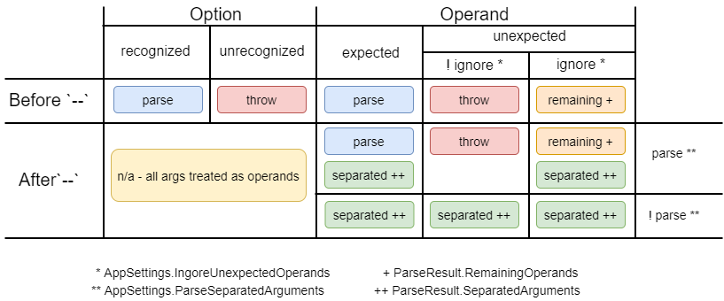

# Argument Separator

The argument separater `--` has been adopted by various tools to serve two different strategies: [end-of-options indicator](#end-of-options-indicator) and [pass-thru arguments](#pass-thru-arguments).

Use `AppSettings.DefaultArgumentSeparatorStrategy` to specify the which strategy to use.

The default is `EndOfOptions` so that by default users have it as a fallback to enter any value as an operand.

The strategy an be changed for a command using the `Command` attribute: `[Command(ArgumentSeparatorStrategy=ArgumentSeparatorStrategy.PassThru)]`.

We recommend leaving the default as `EndOfOptions` and overriding on the `Command` as needed.

## End of Options Indicator

[Posix guideline (#10)](https://pubs.opengroup.org/onlinepubs/9699919799/basedefs/V1_chap12.html#tag_12_02) 

> The first -- argument that is not an option-argument should be accepted as a delimiter indicating the end of options. Any following arguments should be treated as operands, even if they begin with the '-' character.

This was created to handle cases where operand values begin with `-` or `--` causing the parser to interpret them as options.

Take the calculator example `add 1 2`. Let's try with negative numbers...

```bash
~
$ calculator.exe add -1 -2

Unrecognized option '-1'
```

And now with the separator

```bash
~
$ calculator.exe add -- -1 -2

3
```

All operands after the first ` -- ` will be stored in `CommandContext.ParseResult.SeparatedArguments` regardless of whether they were expected or not.

## Unexpected Operands

Unexpected operands occur when there are no longer operands to assign values to. This will result in a parsing exception unless `AppSettings.IgnoreUnexpectedOperands` is true, and then they will be stored in `CommandContext.ParseResult.RemainingOperands`.

```bash
~
$ calculator.exe add 1 2 3

Unrecognized command or argument '3'
```

## Pass-thru arguments

While the Posix guideline specifies the `--` should be used as an end-of-options indicator, there's a common pattern
to use `--` to denote arguments to be passed to a sub-process. 

For example, [dotnet.exe](https://docs.microsoft.com/en-us/dotnet/core/tools/dotnet-run#options) has this discription for `--`:

> Delimits arguments to dotnet run from arguments for the application being run. All arguments after this delimiter are passed to the application run.

```bash
dotnet run -- --input sunrise.CR2 --output sunrise.JPG
```

is equivalent to

```bash
imageconv.exe --input sunrise.CR2 --output sunrise.JPG
```

Help will append ` [[--] <arg>...]` to the usage example when `PassThru` is used.

## How to support both?

Explicit support for both concepts is complicated to provide generically because the framework cannot know

* if a operands for a given command can be formatted like options or directives
* if a command can expect pass-thru arguments 
* if a user entered `--` to indicate end-of-options or pass-thru arguments

Due to this complexity, we'll give you the data and let you determine the best approach based on the requirements of the command.

For all cases, whether via AppSettings or CommandAttribute

* IgnoreUnexpectedOperands = true
* ArgumentSeparatorStrategy = ArgumentSeparatorStrategy.EndOfOptions

### Approach #1:

Using a *Random* command that takes a single number and then calls another program.

When `Random 1 -- 2 3`

* `CommandContext.ParseResult.RemainingOperands` contains `{"2", "3"}`
* `CommandContext.ParseResult.SeparatedArguments` contains `{"2", "3"}`

When `Random -- -1 2 3`

* `CommandContext.ParseResult.RemainingOperands` contains `{"2", "3"}`
* `CommandContext.ParseResult.SeparatedArguments` contains `{"-1", "2", "3"}`

In this case, RemainingOperands always contains the pass-thru arguments.

### Approach #2:

Check for a second `--`

When `Random 1 -- 2 3`

* `CommandContext.ParseResult.RemainingOperands` contains `{"2", "3"}`
* `CommandContext.ParseResult.SeparatedArguments` contains `{"2", "3"}`

When `Random -- -1 -- 2 3`

* `CommandContext.ParseResult.RemainingOperands` contains `{"--", "2", "3"}`
* `CommandContext.ParseResult.SeparatedArguments` contains `{"-1", "--", "2", "3"}`

### Approach #3:

Override the help usage example and specify a different PassThru argument separator, eg. ` __ `

When `Random 1 __ 2 3`

* `CommandContext.ParseResult.RemainingOperands` contains `{"__", "2", "3"}`
* `CommandContext.ParseResult.SeparatedArguments` contains `{ }`

When `Random -- -1 __ 2 3`

* `CommandContext.ParseResult.RemainingOperands` contains `{"__", "2", "3"}`
* `CommandContext.ParseResult.SeparatedArguments` contains `{"-1", "__", "2", "3"}`

## Argument Parsing Diagram

This diagram shows how the parser handles options and operands based on settings.

