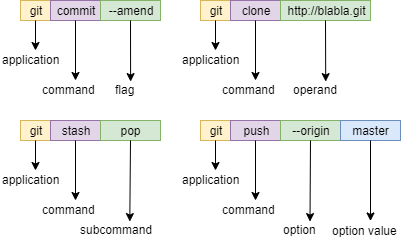
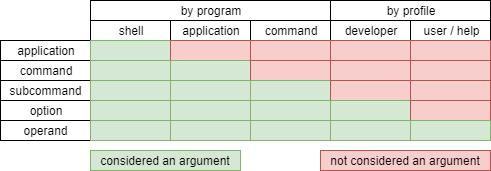

# Terminology

This document describes the terminology used in CommandDotNet and the reasoning for it. If you're wondering why we use the term `Operand` and why operands are referred to as `Arguments` in the help docs, keep reading.

Terminology for arguments can be confusing. When should an argument be an option, switch, flag, argument or parameter. Should it be named or positional? Is an option always optional?

Part of the confusion is the overloaded nature of of the term `argument`, as explained in [this article](http://www.informit.com/articles/article.aspx?p=175771). Context determines what is considered an argument. 

TLDR: The terminology of this framework.

## Perspective matters

Let's look at the `git stash store` command to see how different perspectives see it. 
Git help describes the usage as `git stash store [-m|--message <message>] [-q|--quiet] <commit>`. 

Let's say we executed this command as follows: `git stash store -q -m 'my stash' e7a8621`

For programmatic perspective of the...

* shell: every word is an argument. `git stash store -q -m 'my stash' e7a8621` 
* application: the arguments are `stash store -q -m 'my stash' e7a8621`, as assigned to `Main(string[] args)`
* `stash` command: the arguments are `store`. Once a subcommand is specified, all remaining arguments are for the subcommand.
* `store` command: the arguments are `-q -m 'my stash' e7a8621`.

From the human perspective of...

* developer: the arguments are `-q -m 'my stash' e7a8621`. `-q` and `-m` are options. `'my stash'` and `e7a8621` are operands.
* user: the arguments are `e7a8621`. `-q` and `-m` are options. Common conventions of help documentation distinguishes options from arguments.

## CommandDotNet Perspectives

### Console app user

The user needs to understand how to provide values and so they need to know when arguments are named are which are positional

### Console app developer
The developer of the console app needs to define arguments that are named vs positional, which arguments are required for the operation and which change how it runs. 

#### Example
Let's take a data-migration command. Selecting a customer to run the command for changes the context of the command but the script to run is integral to the operation. The script could be an operand and the company an option.

### Framework developer
The developer of middleware components: often need to operate across all command arguments regardless of type.

## Addressed in the following ways

* For users of the console app
    * help documentation is the interface. 
    * terminoloy: `command`, `option` and `argument`.
* For developers
    * terminoloy: `command`, `argument`, `option` and `operand`
    * types: `Command`, `IArgumentNode`, `IArgument`, `Option` and `Operand`.
    * Option and Operand are the two concrete types of IArgument
        * Option: named argument
        * Operand: positional argument
    * Command, Option and Operand are the three concrete types of IArgumentNode
    * Command contains collections of Option, Operand and Command (as subcommands)
    * Arguments are defined using
        * parameters: of a command method
        * properties: of an `IArgumentModel`

Flags are defined as Options with BooleanMode = Implicit.  This is the default for Options of type bool and can be changed using `AppSettings.DefaultBooleanMode` or `OptionAttribute.BooleanMode`.