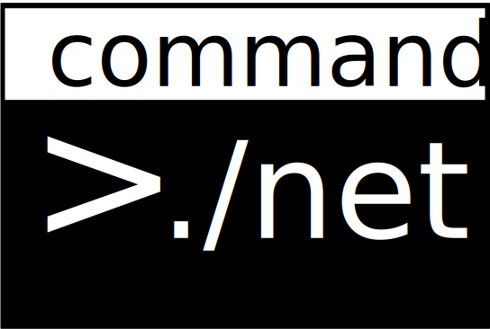

{: style="width:20em"}

# Introduction

***Model your command line application interface in a class***

The purpose of this **framework** is to let developers focus on the core logic of command line application by defining commands with methods and arguments with parameters. 

*Out-of-the-box* support for help documentation, subcommmands, dependency injection, validation, piping, prompting, passwords, response files and more. 

Includes [test tools](TestTools/overview.md) used by the framework to test all features of the framework.

Modify and extend the functionality of the framework through configuration and middleware.

## Credits 🎉

Special thanks to [Drew Burlingame](https://github.com/drewburlingame) for continuous support and contributions

## V3

Version 3 links: [Documentation](https://commanddotnet.bilal-fazlani.com/) and [GitHub](https://github.com/bilal-fazlani/commanddotnet/) 

## V2

Version 2 links: [Documentation](https://v2.commanddotnet.bilal-fazlani.com/) and [GitHub](https://github.com/bilal-fazlani/commanddotnet/tree/v2) 
